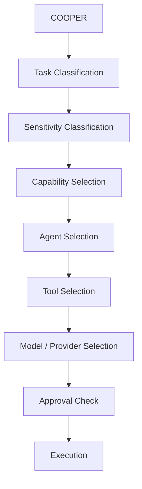

# COOPER Agent Routing Architecture

COOPER routes work by classifying the task, classifying sensitivity, matching capabilities, selecting an agent, selecting tools, selecting a provider/model, checking approval state, and only then permitting execution.

## Routing Flow

## Routing Inputs

Routing should consider:

- task type
- goal type
- category
- approval state
- required tools
- required capabilities
- preferred providers
- fallback providers

## Capability Selection

Capability selection is the primary routing step after sensitivity classification.

### Capability Registry

The capability registry is the catalog COOPER uses to map work to capability classes before choosing an agent.

Suggested capability classes:

- research
- source discovery
- large-context analysis
- report writing
- report review
- code implementation
- code review
- repo modification
- automation design
- n8n workflow design
- local restricted analysis
- file processing
- dashboard/status generation
- memory summarization
- skill promotion review

### Capability Selection Rules

- Match the task to the smallest capability set that can safely complete it.
- Prefer local capabilities when category restrictions require it.
- Use the capability registry before choosing a provider or model.
- Do not infer governance from the provider choice.

## Routing Decisions

### Task Type

Determine the general work class:

- research
- reporting
- review
- build
- automation
- restricted/local

### Sensitivity Category

Determine whether the task is:

- Category 1
- Category 2
- restricted local

### Agent Selection

Pick the best agent profile based on the selected capability set and sensitivity rules.

### Tool Selection

Choose a tool harness that can execute the required action without violating policy.

### Model / Provider Selection

Provider selection is lower-level than capability selection.

Selection criteria:

- capability fit
- sensitivity category
- tool availability
- approval state
- cost / speed / capability tradeoff
- fallback availability

Examples:

- Claude Code belongs under code/build/repo modification capabilities.
- Codex belongs under code/build/review capabilities.
- Gemini belongs under research and large-context capabilities.
- Claude belongs under writing, review, and analysis capabilities.
- Local models belong under restricted/local-only capabilities.

### Approval Check

If the task is governed, execution may not proceed until the approval workflow authorizes it.

## LiteLLM Strategy

LiteLLM remains the routing layer for provider/model selection, not the governance layer.

### Preferred Provider Routing

- Research capability should prefer Gemini.
- Reporting capability should prefer Claude.
- Review capability should prefer Claude, with Codex as secondary.
- Build and automation capabilities should prefer Claude Code, with Codex as secondary.
- Restricted capability should stay local and avoid cloud routing.

### Fallback Strategy

Fallbacks should be chosen for capability and availability, not to bypass policy.

- Gemini can fall back to Claude for research when appropriate.
- Claude can fall back to Gemini for reporting if needed.
- Codex remains the secondary implementation and review path.
- Local-only tasks must not fall back to cloud models.

### Category 2 Enforcement

- Category 2 work must remain local-only.
- LiteLLM can participate only if the route is explicitly allowed.
- Any cloud model path must be blocked if policy requires local-only.

### Governance Boundary

LiteLLM must never decide approval state.

- It can route models.
- It cannot authorize execution.
- It cannot override category restrictions.
- It cannot override the approval workflow.

## Tool Selection Strategy

Agents should choose tools based on task requirements, not model popularity.

### Approved Tool Classes

- PowerShell: tool harness
- Python: tool harness
- n8n: deterministic workflow execution
- LiteLLM: governed provider/model routing
- Browser: local verification and inspection
- MCP tools: future local integrations

### Selection Rules

- PowerShell is a harness, not a reasoning layer.
- Python is a harness, not a reasoning layer.
- n8n handles deterministic automation and integration workflows.
- Browser is for inspection, validation, and local targets.
- MCP tools should stay bounded and auditable.

## Worker Evolution Plan

### Current

- Worker equals a PowerShell-scripted operational unit.

### Future

- Worker becomes an AI-powered role with:
  - tools
  - skills
  - governance
  - isolated context

### Compatibility Rule

Existing workers must continue to function while future AI-powered worker agents are introduced.

## Hermes-Inspired Integration Points

The following concepts are future phases only:

- bounded memory packets
- skill library
- learning loop
- subagent profiles
- isolated context
- messaging gateway

### Placement in the Architecture

- Memory packets inform agent selection and future briefings.
- Skills become reusable patterns after repeated success and approval.
- The learning loop turns successful work into promotable knowledge.
- Subagent profiles provide isolated context and tool access.
- A messaging gateway can mediate inter-agent communication later.

## Future Operating Order

The long-term path is:

1. COOPER
2. Task Classification
3. Sensitivity Classification
4. Capability Selection
5. Agent Selection
6. Tool Selection
7. Model / Provider Selection
8. Approval Check
9. Execution

## Routing Examples

### Example 1

- Task: Modify PowerShell script
- Capability: code implementation + repo modification
- Agent: Build Agent
- Provider/tool: Claude Code preferred, Codex fallback
- Approval: required

### Example 2

- Task: Research Hermes Agent
- Capability: research + source discovery + synthesis
- Agent: Research Agent
- Provider/tool: Gemini / Perplexity / Claude depending availability
- Approval: not required unless dispatching an action

### Example 3

- Task: Review report draft
- Capability: report review + writing critique
- Agent: Review Agent
- Provider/tool: Claude preferred, Gemini fallback
- Approval: not required for review, required before publishing or sending

### Example 4

- Task: Analyze Category 2 restricted notes
- Capability: local restricted analysis
- Agent: Restricted Agent
- Provider/tool: local model only
- Approval: required
- Cloud: prohibited

The decision remains governed even as agent capabilities expand.

## Risks

- Treating routing as governance.
- Letting model preference override category restrictions.
- Allowing future agent profiles to bypass approval gates.
- Mixing local-only and cloud-capable paths without explicit policy checks.
- Treating provider choice as if it were the architecture layer.

## Dependencies

- COOPER identity and personality layer
- Approval workflow foundation
- Agent loop foundation
- Decision engine
- Chat bridge and command handoff
- Dashboard status reporting
- Model routing and ontology rules
