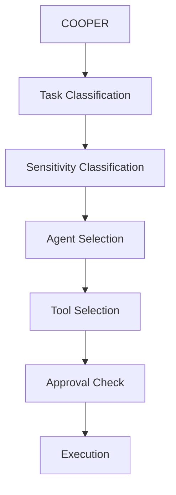

# COOPER Agent Routing Architecture

COOPER routes work by classifying the task, classifying sensitivity, selecting an agent, selecting tools, checking approval state, and only then permitting execution.

## Routing Flow

## Routing Inputs

Routing should consider:

- task type
- goal type
- category
- approval state
- required tools
- required capabilities
- preferred models

## Routing Decisions

### Task Type

Determine the general work class:

- research
- reporting
- review
- build
- automation
- restricted/local

### Sensitivity Category

Determine whether the task is:

- Category 1
- Category 2
- restricted local

### Agent Selection

Pick the best agent profile based on the task and sensitivity rules.

### Tool Selection

Choose a tool harness that can execute the required action without violating policy.

### Approval Check

If the task is governed, execution may not proceed until the approval workflow authorizes it.

## LiteLLM Strategy

LiteLLM remains the routing layer for model selection, not the governance layer.

### Preferred Model Routing

- Research requests should prefer Gemini.
- Reporting requests should prefer Claude.
- Review requests should prefer Claude, with Codex as secondary.
- Build and automation requests should prefer Claude Code, with Codex as secondary.
- Restricted work should stay local and avoid cloud routing.

### Fallback Strategy

Fallbacks should be chosen for capability and availability, not to bypass policy.

- Gemini can fall back to Claude for research when appropriate.
- Claude can fall back to Gemini for reporting if needed.
- Codex remains the secondary implementation and review path.
- Local-only tasks must not fall back to cloud models.

### Category 2 Enforcement

- Category 2 work must remain local-only.
- LiteLLM can participate only if the route is explicitly allowed.
- Any cloud model path must be blocked if policy requires local-only.

### Governance Boundary

LiteLLM must never decide approval state.

- It can route models.
- It cannot authorize execution.
- It cannot override category restrictions.
- It cannot override the approval workflow.

## Tool Selection Strategy

Agents should choose tools based on task requirements, not model popularity.

### Approved Tool Classes

- PowerShell: tool harness
- Python: tool harness
- n8n: deterministic workflow execution
- LiteLLM: governed model routing
- Browser: local verification and inspection
- MCP tools: future local integrations

### Selection Rules

- PowerShell is a harness, not a reasoning layer.
- Python is a harness, not a reasoning layer.
- n8n handles deterministic automation and integration workflows.
- Browser is for inspection, validation, and local targets.
- MCP tools should stay bounded and auditable.

## Worker Evolution Plan

### Current

- Worker equals a PowerShell-scripted operational unit.

### Future

- Worker becomes an AI-powered role with:
  - tools
  - skills
  - governance
  - isolated context

### Compatibility Rule

Existing workers must continue to function while future AI-powered worker agents are introduced.

## Hermes-Inspired Integration Points

The following concepts are future phases only:

- bounded memory packets
- skill library
- learning loop
- subagent profiles
- isolated context
- messaging gateway

### Placement in the Architecture

- Memory packets inform agent selection and future briefings.
- Skills become reusable patterns after repeated success and approval.
- The learning loop turns successful work into promotable knowledge.
- Subagent profiles provide isolated context and tool access.
- A messaging gateway can mediate inter-agent communication later.

## Future Operating Order

The long-term path is:

1. COOPER
2. Task Classification
3. Sensitivity Classification
4. Agent Selection
5. Tool Selection
6. Approval Check
7. Execution

The decision remains governed even as agent capabilities expand.

## Risks

- Treating routing as governance.
- Letting model preference override category restrictions.
- Allowing future agent profiles to bypass approval gates.
- Mixing local-only and cloud-capable paths without explicit policy checks.

## Dependencies

- COOPER identity and personality layer
- Approval workflow foundation
- Agent loop foundation
- Decision engine
- Chat bridge and command handoff
- Dashboard status reporting
- Model routing and ontology rules

