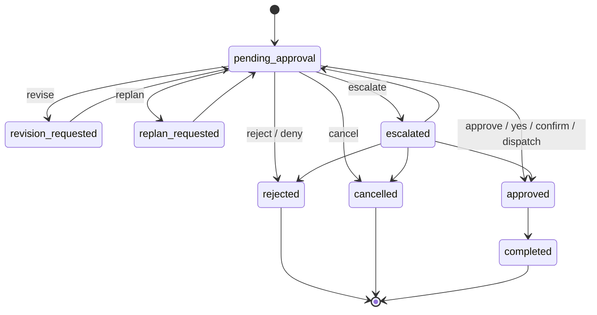

# COOPER Approval Workflow

COOPER approval workflow is the governed interlock between planning and execution. It persists approval state locally, survives restarts, records audit history, and blocks execution until a human approves the requested action.

## Purpose

- Preserve human control over execution.
- Persist approval state independently from transient chat state.
- Provide auditability for approvals, rejections, revisions, replans, escalations, and cancellations.
- Support the agent loop, chat bridge replay, and dashboard reporting.
- Enforce Category 1 / Category 2 governance before any dispatch.

## Durable Store

Approval objects are stored in:

- `PDA-Runtime/data/approval-workflows/pending_approval/`
- `PDA-Runtime/data/approval-workflows/approved/`
- `PDA-Runtime/data/approval-workflows/rejected/`
- `PDA-Runtime/data/approval-workflows/revision_requested/`
- `PDA-Runtime/data/approval-workflows/replan_requested/`
- `PDA-Runtime/data/approval-workflows/escalated/`
- `PDA-Runtime/data/approval-workflows/cancelled/`
- `PDA-Runtime/data/approval-workflows/completed/`

The runtime store is intentionally local-only and should not be committed.

## Approval Object Schema

Recommended fields:

- `approval_id`
- `run_id`
- `conversation_id`
- `session_id`
- `goal`
- `requested_action`
- `category`
- `route_type`
- `recommended_command`
- `recommended_executor`
- `dispatch_category`
- `user_message`
- `approval_kind`
- `approval_required`
- `status`
- `approved`
- `dispatch_ready`
- `request_timestamp`
- `response_timestamp`
- `approver`
- `rationale`
- `created_at`
- `updated_at`
- `history`
- `approval_history`
- `approval_path`

## Approval Actions

Supported human actions:

- `approve`
- `reject`
- `revise`
- `replan`
- `escalate`
- `cancel`

Approval actions are state transitions, not free-form dispatch requests.

## Approval States

Canonical states:

- `pending_approval`
- `approved`
- `rejected`
- `revision_requested`
- `replan_requested`
- `escalated`
- `cancelled`
- `completed`

## State Model

## Chat Bridge Replay

The chat bridge keeps approval state durable across turns:

1. A goal plan or governed request creates a pending approval record.
2. The conversation state references the durable `approval_id`.
3. Approval phrases such as `approved`, `approve`, `yes`, `confirm`, and `dispatch` resume the same approval record.
4. The bridge updates approval state before any governed dispatch.
5. If conversation state is incomplete, the bridge can recover the pending approval from the durable approval store.

## Agent Loop Enforcement

- Agent runs reference `approval_id` and `approval_path`.
- The loop must not continue into execution while approval is pending.
- Result recording and next-step generation remain governed by approval state.
- Approval status updates are persisted back into the approval store and conversation state.

## Dashboard Visibility

The dashboard should expose an approval block with:

- pending approval count
- approval totals by state
- blocked agent runs waiting on approval
- recent approvals and transitions

The dashboard should clearly label any blocked work as **Awaiting Human Approval**.

## Governance

- Category 1 requests may use approved cloud-capable routing if policy allows.
- Category 2 and `restricted_local` requests must remain local-only.
- Approval state does not override category restrictions.
- Approval history must include who approved, when, and why.

## Related Scripts

- `Scripts/PDA_ApprovalWorkflow.ps1`
- `Scripts/New-PDAApprovalRequest.ps1`
- `Scripts/Get-PDAApprovalRequest.ps1`
- `Scripts/Update-PDAApprovalRequest.ps1`
- `Scripts/Get-PDAApprovalWorkflowStatus.ps1`
- `Scripts/Test-PDAApprovalWorkflow.ps1`

