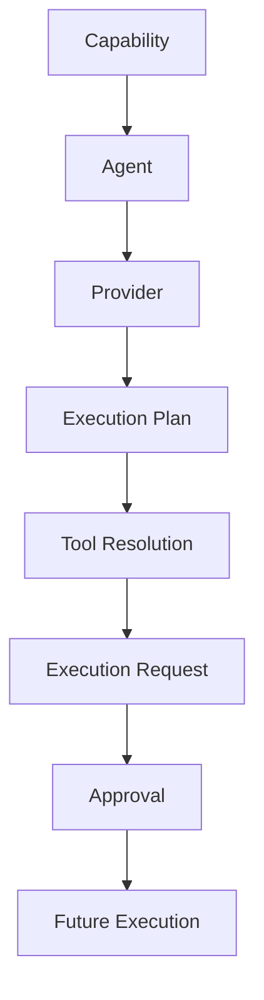

# COOPER Execution Foundation

## Purpose

This layer prepares governed work packages before execution exists.

It extends the current COOPER routing chain from:

`Capability -> Agent -> Provider -> Execution Plan`

to:

`Capability -> Agent -> Provider -> Execution Plan -> Tool Resolution -> Execution Request -> Approval`

The foundation is intentionally non-executing.

## Runtime Boundary

The foundation:

- resolves tools deterministically
- packages work into request records
- links requests to approval records
- persists state locally so it survives restart
- keeps Category 2 routes local-only

The foundation does not:

- execute tools
- dispatch n8n workflows
- call models during request creation
- modify files as an execution side effect

## Tool Registry

The runtime tool registry is stored in `Scripts/PDA_ToolRegistry.json`.

### Registered tools

- PowerShell
- Python
- n8n
- Browser
- LiteLLM
- Claude Code
- Codex
- Gemini CLI
- Open WebUI
- Local LLM
- File System
- Obsidian
- Fabric

### Registry fields

Each tool entry defines:

- `tool_id`
- `display_name`
- `description`
- `supported_capabilities`
- `supported_agents`
- `local_only`
- `category_allowed`
- `approval_required`
- `risk_level`
- `inputs`
- `outputs`
- `notes`

### Selection rules

- Capability comes first.
- Agent compatibility is the next filter.
- Category 2 routes stay local-only.
- The selected tool is deterministic for the same inputs.

## Execution Request Schema

The execution request registry is stored in `Scripts/PDA_ExecutionRequestRegistry.json`.

### Request record fields

Each governed request record defines:

- `request_id`
- `request_type`
- `capability`
- `agent`
- `provider`
- `tool`
- `approval_required`
- `restricted_local_only`
- `expected_inputs`
- `expected_outputs`
- `execution_plan_id`
- `notes`

### Request statuses

- `draft`
- `pending_approval`
- `approved`
- `rejected`
- `cancelled`
- `completed` for future use only

### Request behavior

- Requests are created locally and persisted to disk.
- Requests carry the selected execution plan and tool resolution.
- Requests reference approval records when approval is required.
- Requests remain auditable even after restart.

## Approval Integration

The execution-request layer uses the existing approval workflow as the authoritative gate.

### Integration rules

- approval remains the final authority
- execution requests inherit approval requirements from the plan and tool context
- execution requests store approval IDs and approval paths
- approval records are not replaced or weakened
- approval state continues to survive restart independently of the conversation

The execution-request layer does not change approval state-machine behavior.

## Dashboard Integration

Status surfaces now expose execution-request health alongside approval health.

### Exposed values

- pending execution requests
- approved execution requests
- draft requests
- request counts
- request readiness
- restricted local-only request counts

### Dashboard behavior

- no execution metrics yet
- no dispatch metrics yet
- no tool execution metrics yet
- request summaries are read-only status surfaces

## Validation

Validation now covers the full pre-execution chain:

- tool registry validation
- agent resolver validation
- provider resolver validation
- execution plan resolver validation
- execution request validation
- approval workflow validation
- orchestration file-set validation

## Progress Notes

- Current explosions: 0
- The foundation is advisory and governed only
- The work package layer is ready for future execution, but not execution itself
