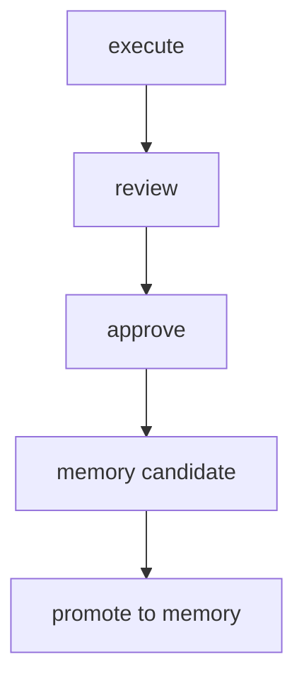

# COOPER Memory Architecture

COOPER memory is the commander's pocket notebook: bounded, curated, auditable, and designed to support future agent runs without becoming a second Obsidian vault.

## Architecture Model

- **Obsidian** is the knowledge base.
- **Dashboard** is the live status board.
- **COOPER Memory** is the bounded operational pocket notebook.

## Purpose

COOPER memory should preserve only the information that improves future operational decisions:

- operator preferences
- ecosystem facts
- live priorities
- active approvals
- useful lessons
- successful workflows

## Memory Packet Structure

### COOPER_USER.md

Purpose:

- operator preferences
- communication preferences
- standing instructions
- preferred tone and briefing style

### COOPER_SYSTEM.md

Purpose:

- ecosystem facts
- runtime facts
- architecture facts
- known commands
- approved tool and route conventions

### COOPER_WORKING_MEMORY.md

Purpose:

- active goals
- pending approvals
- active agent runs
- current priorities
- immediate blockers

### COOPER_LESSONS.md

Purpose:

- lessons learned
- successful approaches
- failures
- recommendations
- repeatable patterns

## Storage and Boundedness

COOPER memory should be stored in a bounded local runtime area such as:

- `PDA-Runtime/data/cooper-memory/`

Recommended subfolders:

- `user/`
- `system/`
- `working/`
- `lessons/`
- `candidates/`
- `index/`

The memory layer should:

- remain lightweight
- summarize instead of dumping full histories
- preserve auditability
- avoid duplicating the entire Obsidian vault

## Memory Rules

### Allowed

- curated summaries
- approved outcomes
- current objectives
- reusable procedures
- policy-relevant reminders
- scoped lessons from completed work

### Not Allowed

- unrestricted historical dumps
- raw vault replication
- policy bypassing
- Category 1 / Category 2 violations
- silent auto-promotion

## Memory Promotion Flow

Memory should be promoted through a governed pipeline:



Promotion sources:

- completed agent runs
- approved outcomes
- successful workflows

## Relationship to Future Skill System

Future evolution should allow repeated successful memory to become skill candidates:

```text
Memory
↓
Repeated Success
↓
Skill Candidate
↓
Approved Skill
```

## Integration Points

- **COOPER**: surfaces memory-aware recommendations and briefings.
- **Agent Loop**: records outcomes and candidates from completed runs.
- **Approval Workflow**: controls when a memory-related action may be promoted.
- **Dashboard**: shows memory counts, candidates, and pending approvals.
- **Future Agent Profiles**: consume bounded memory packets as scoped context.

## Packet Size Guidance

Keep packets short enough to remain operational:

- prefer summaries over transcripts
- prefer recent state over historical dumps
- prefer curated facts over raw artifacts
- avoid large prompt payloads

## Governance

Memory is not autonomy.

- No automatic learning yet.
- No automatic promotion yet.
- No category policy bypass.
- No cloud routing for restricted material.
- No replacement of approval workflow.

## Future Use

When mature, COOPER memory can feed:

- briefing generation
- plan selection
- executor routing
- skill promotion
- future agent subprofiles

