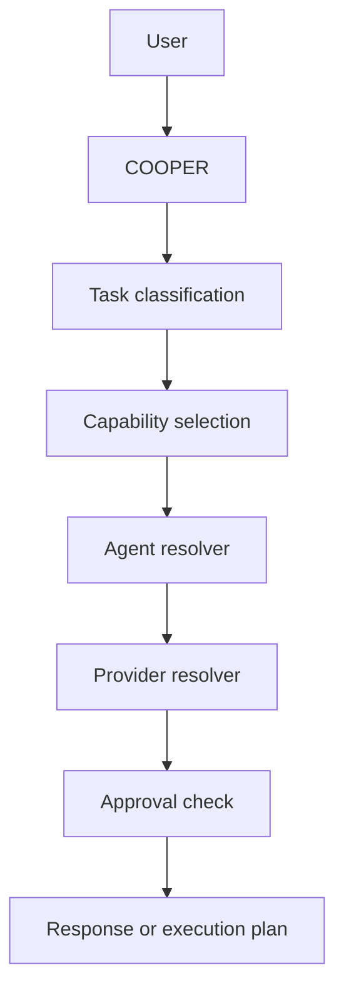

# COOPER Open WebUI Operator Model

COOPER is the selectable operator surface in Open WebUI. It is not a model. It is the governed interface that sits above model selection, capability routing, agent selection, approval policy, and local-first provider escalation.

## What Open WebUI Shows

In the model picker, users should see both:

- `COOPER` for orchestrated operator mode
- direct model choices such as `Claude`, `Gemini`, `GPT`, `OpenRouter models`, and `Local models`

That separation matters:

- `COOPER` runs orchestration and routing.
- Direct model selection bypasses COOPER orchestration and uses the chosen provider directly.

## COOPER Behavior

COOPER follows a local-first routing strategy:

1. Start with `local-llama`.
2. Classify the task and select a capability.
3. Resolve the target agent.
4. Select a provider only if the task benefits from escalation.
5. Check approval requirements before any governed execution path.

COOPER escalates only when the route needs it:

- research or source discovery
- large-context synthesis
- report writing or review quality
- code implementation or automation design
- explicit user request for a cloud provider
- low local confidence, if confidence metadata is available

## Category 2 Rule

Category 2 and restricted-local work are local-only.

- No cloud escalation is allowed.
- `local-llama` remains the provider.
- Approval still applies where the capability or agent policy requires it.

## Relationship Model

## Runtime Files

- `Scripts/Get-COOPERIdentity.ps1`
- `Scripts/PDA_ProviderRoutingPolicy.json`
- `Scripts/Resolve-PDAProvider.ps1`
- `Scripts/Test-PDAProviderResolver.ps1`
- `Open WebUI/PDA_ChatBridge_Pipe.py`

## Practical Meaning

If a user selects `COOPER` in Open WebUI:

- the chat goes through the COOPER pipe
- the pipe remains the operator entrypoint
- the runtime can choose `local-llama` first
- the runtime can escalate to a cloud provider only when policy and capability say so

If a user selects `Claude`, `Gemini`, `GPT`, `OpenRouter models`, or `Local models` directly:

- the model is used directly
- COOPER orchestration is bypassed unless the user later routes the work through COOPER

## Notes

- COOPER is the orchestration layer, not the provider catalog.
- Providers are escalation paths, not defaults.
- `local-llama` is the default under COOPER.
- The operator route should stay auditable and local-first.
