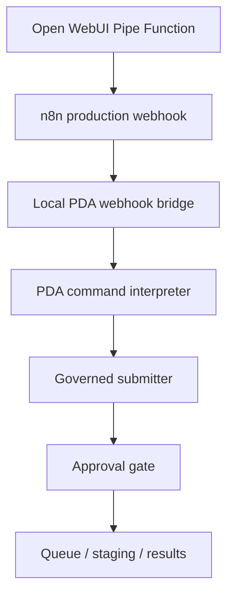

# Open WebUI Integration

This document defines the Open WebUI chat path for PDA Commander.

## Dual-Provider Model Access

Open WebUI now serves two distinct model access patterns:

- **LiteLLM** is the governed PDA gateway. It exposes the curated PDA aliases used for approved workflow routing and stable day-to-day use.
- **OpenRouter direct** is connected separately as an OpenAI-compatible provider for exploration and broad model catalog browsing.
- **PDA Commander** remains a preserved Pipe Function workflow and is not replaced by either provider connection.

### Current Model Sources

- **LiteLLM governed gateway**: `http://host.docker.internal:4000/v1`
  - Curated aliases: `local-llama`, `openai`, `claude`, `gemini`, `openrouter`
- **OpenRouter Catalog**: `https://openrouter.ai/api/v1`
  - Large external catalog for discovery and ad hoc use
- **PDA Commander**: preserved as the `PDA Commander` Pipe Function in Open WebUI

### Governance Notes

- Category 2 and `restricted_local` work must remain on `local-llama` only.
- Do not treat the OpenRouter catalog as the governed default path for PDA automation.
- LiteLLM remains the approved control point for curated aliases, auth, and future routing policy.
- The OpenRouter catalog can be noisy and crowded in the model selector. Enable model-list caching and consider a later allowlist if the UI becomes difficult to use.

## Architecture



## Contract

- Open WebUI calls the n8n production webhook through a Pipe Function.
- The Pipe sends `user_message` and `confirm_dispatch` to `http://localhost:5678/webhook/pda-chat-bridge-http`.
- The n8n workflow forwards the request to `http://host.docker.internal:8788/pda-chat-bridge`.
- The local PowerShell bridge returns machine-readable JSON with recommendation and dispatch status.
- No direct queue access is allowed from Open WebUI, n8n, or the webhook layer.
- The bridge server binds to local interfaces on port `8788` so Docker can reach it through the host gateway.
- The bridge server exposes a lightweight health endpoint at `http://localhost:8788/pda-chat-bridge/healthz` for `aiec-status` and startup checks.

## Operator Console Commands

PDA Commander now supports explicit read-only operator console commands in addition to governed task submission.

- `/status` - system health, queue depth, worker state, model status, and commander integration
- `/tasks` - latest tracked task summary
- `/approvals` - pending approvals summary
- `/workers` - worker registry and runtime status
- `/reports` - recent report and artifact index summary
- `/memory` - memory index summary
- `/help` - command reference
- `/fabric research|report|review|security` - local Fabric CLI runs from sanitized inputs only
- `/notebooklm` - sanitized NotebookLM package creation from Category 1 notes only
- Natural-language Commander prompts:
  - `What should I work on next?`
  - `Give me my PDA briefing.`
  - `What is blocked?`
  - `What needs attention?`
  - `What changed recently?`

These commands are read-only and do not require approval. They should return human-readable summaries, not raw JSON. `/notebooklm` is a governed local command that still requires explicit confirmation before it creates the package.

## Recommended Open WebUI Method

Use a **Pipe Function**.

- Pipes are first-class selectable models in the Open WebUI chat sidebar.
- Pipes control the full request/response cycle, which fits the PDA's two-step confirmation flow.
- Tools are designed for model-invoked API calls during inference, not for a user-facing chat model wrapper.
- Pipelines are better reserved for heavier or externalized processing.
- Actions are useful later if you want a button-based confirmation shortcut, but they are not required for the base chat flow.

## Deployment Instructions

1. Place the repository on the same host where n8n can execute `pwsh`.
2. Ensure `Scripts/Invoke-PDAWebhookBridge.ps1` is reachable from the n8n runtime path.
3. Import and activate `n8n Workflow/PDA-ChatBridge-HTTP.json` in n8n.
4. Run `Scripts/Start-PDAWebhookServer.ps1` on the host machine before testing the HTTP workflow.
5. In Open WebUI, create a Pipe Function from [Open WebUI/PDA_ChatBridge_Pipe.py](C:\Users\earth\Proton Drive\Wjwilbourn\My files\Proton Drive\AI Ecosystem\Open WebUI\PDA_ChatBridge_Pipe.py).
6. Set the Pipe Function's `N8N_WEBHOOK_URL` valve to `http://host.docker.internal:5678/webhook/pda-chat-bridge-http` if Open WebUI runs in Docker, or `http://localhost:5678/webhook/pda-chat-bridge-http` if it runs on the host.
7. Enable the Pipe Function and select `PDA Commander` as the active model in the chat sidebar.
8. Confirm that the Open WebUI model points to the PDA Commander Pipe, not to queue files or workers.

## NotebookLM Command Flow

Use `/notebooklm` to generate a sanitized NotebookLM upload package without automating NotebookLM login or upload.

Example usage: `/notebooklm LearningArea: Research Topic: NotebookLM Command Integration Test SourcePaths: ...`

Example message:

```text
/notebooklm
LearningArea: Research
Topic: NotebookLM Command Integration Test
SourcePaths:
- Obsidian Vault\02_Projects\AI Tool Ecosystem\NotebookLM\NotebookLM-Integration-Guide.md
- Obsidian Vault\02_Projects\AI Tool Ecosystem\NotebookLM\NotebookLM-Sanitization-Checklist.md
Summary:
Sanitized NotebookLM package for local learning validation.
Questions:
- What are the main steps?
- Which notes are safe to upload?
```

The command flow remains local-first:

1. Open WebUI sends the message through the PDA bridge.
2. The interpreter maps it to `/notebooklm`.
3. The governed handoff calls `Scripts/Invoke-PDANotebookLMCommand.ps1`.
4. The helper calls `Scripts/New-PDANotebookLMPackage.ps1`.
5. The result is logged in `PDA-Tasks/results` and the package is written under `PDA-Backups/notebooklm/`.
6. You manually upload the generated package to NotebookLM.

## Fabric CLI Command Flow

Use `/fabric` aliases for local-only Fabric CLI pattern runs on sanitized inputs.

Example usage:

```text
/fabric research
/fabric report
/fabric review
/fabric security
```

Routing summary:

1. Open WebUI sends the message through the PDA bridge.
2. The interpreter maps it to a governed `/fabric` alias.
3. The governed handoff submits a Fabric task with the matching local pattern.
4. The Fabric worker invokes the local CLI against the synced PDA pattern directory.
5. The result is logged in `PDA-Tasks/results` and the artifact lands in the Fabric findings folder.

Pattern setup:

1. Install Fabric CLI with `Scripts/Install-PDAFabricHelper.ps1`.
2. Confirm `fabric --version` and `fabric --listpatterns` work.
3. Sync the PDA Fabric pattern files into the Fabric config patterns directory.
4. Keep Category 2 inputs local and sanitized only.

## Configuration Instructions

- The Pipe Function sends the first pass with `confirm_dispatch = false`.
- The Pipe Function only replays with `confirm_dispatch = true` after explicit user approval in the chat.
- Keep the `confirm_dispatch` valve path disabled on first-pass recommendations.
- Do not bypass the bridge by calling submitters, queue workers, or workers directly.
- The Pipe Function stores pending confirmation state locally so the second message can replay the governed dispatch.
- The Pipe Function ignores Open WebUI internal title-generation prompts and other internal request patterns so those prompts do not enter PDA command dispatch.
- Normal chat responses are human-readable by default. Raw governed JSON stays in the debug log, and can be appended to chat responses only when `DEBUG_MODE` is enabled.

## Webhook Flow

1. Open WebUI Pipe sends `{ "user_message": "...", "confirm_dispatch": false }` to the n8n production webhook.
2. n8n normalizes the request into `user_message` and `confirm_dispatch`.
3. n8n sends an HTTP request to `http://host.docker.internal:8788/pda-chat-bridge`.
4. `Scripts/Start-PDAWebhookServer.ps1` receives the request locally on port `8788`.
5. The server invokes `Scripts/Invoke-PDAWebhookBridge.ps1 -Message "<text>" -AsJson`.
6. The webhook bridge invokes `Scripts/Invoke-PDAChatBridge.ps1`.
7. The bridge resolves the request against `Scripts/PDA_TaskOntology.json`.
8. If the request is mapped and confirmed, the governed submitter is called.
9. n8n returns the JSON response to Open WebUI.

## Confirmation Flow

- If the interpreter returns `mapped`, the bridge sets `requires_confirmation` to `true` until `confirm_dispatch` is supplied.
- If the result is `ambiguous` or `unknown`, no dispatch is allowed.
- The Pipe Function records the pending request and waits for an explicit user approval phrase before replaying with `confirm_dispatch: true`.
- Confirmation does not bypass ontology, approval, or category controls.
- Read-only operator commands bypass the confirmation flow entirely and never enter the queue.

## Troubleshooting

- If the bridge returns invalid JSON, verify that `pwsh` is installed and the script path is correct.
- If the HTTP bridge workflow cannot reach the server, confirm `Scripts/Start-PDAWebhookServer.ps1` is running on port `8788`.
- `aiec-start` now starts the PDA webhook server after the required Docker services are healthy, and `aiec-status` verifies the bridge on port `8788`.
- `pda-go` starts the human-governed PDA Build Runner on demand when you want to execute the next staged roadmap task without waiting for an overnight schedule. The scheduler is the local PDA Build Runner, the worker is Codex, and the Automations tab is optional only. It preserves the same approval and safety gates, and the default invocation now enters the Codex execution path.
- The exported workflow at `n8n Workflow/PDA-ChatBridge-HTTP.json` is fail-closed. If the local bridge server is offline, n8n should return explicit JSON with `bridge_status = fail_closed` instead of an empty `{}` body.
- If Docker-to-host calls hang, run `Scripts/Test-PDAWebhookServerReachability.ps1` and verify `host.docker.internal` returns HTTP 200 from inside the `pda-n8n` container.
- If dispatch never happens, confirm that the interpreted request maps to a governed command and that the worker eligibility check passes.
- If Category 2 requests are routed externally, stop and validate the ontology and worker registry immediately.
- If the n8n workflow cannot parse the bridge output, run `Scripts/Invoke-PDAWebhookBridge.ps1 -Message "review my latest findings" -AsJson` locally and inspect the JSON.
- If a confirmation appears to be ignored, verify that the request was mapped and that `confirm_dispatch` was sent as a real boolean-like value.
- If Open WebUI loses pending confirmation state after restart, reissue the initial prompt so the Pipe can rebuild the pending entry.

## Recommended Usage

- First call: `confirm_dispatch = false`
- Second call only after explicit user confirmation: `confirm_dispatch = true`
- The bridge remains the source of truth for command recommendation and dispatch readiness.

## Clipboard Import

- Use [`n8n Workflow/PDA-ChatBridge-HTTP-Clipboard.json`](C:\Users\earth\Proton Drive\Wjwilbourn\My files\Proton Drive\AI Ecosystem\n8n%20Workflow\PDA-ChatBridge-HTTP-Clipboard.json) when pasting directly into the n8n canvas.
- If the n8n import dialog creates no nodes, paste the clipboard JSON into the canvas instead of using file import.
- The clipboard workflow is intentionally minimal: nodes plus connections only.
- The HTTP bridge server must be running on `http://localhost:8788/pda-chat-bridge` before testing the pasted workflow, and the n8n HTTP Request node should target `http://host.docker.internal:8788/pda-chat-bridge`.

## Open WebUI Setup

1. In Open WebUI, open `Admin Panel -> Functions`.
2. Click `Create` and choose a new Function ID such as `pda_chat_bridge`.
3. Paste the contents of [Open WebUI/PDA_ChatBridge_Pipe.py](C:\Users\earth\Proton Drive\Wjwilbourn\My files\Proton Drive\AI Ecosystem\Open WebUI\PDA_ChatBridge_Pipe.py).
4. Save the function.
5. Open the function settings and set `N8N_WEBHOOK_URL`.
6. Enable the function.
7. Select `PDA Commander` from the chat model picker.
8. Send an initial message. The function will query the n8n webhook with `confirm_dispatch: false`.
9. Reply with an explicit approval phrase such as `confirm dispatch`. The function will replay the same request with `confirm_dispatch: true`.

## Provider Setup

1. Keep the LiteLLM OpenAI-compatible connection enabled at `http://host.docker.internal:4000/v1`.
2. Use LiteLLM as the source for governed PDA aliases and normal curated model access.
3. Add a second OpenAI-compatible connection for OpenRouter at `https://openrouter.ai/api/v1`.
4. Use bearer auth with the OpenRouter API key.
5. Leave the model filter blank only if you want the full catalog visible.
6. Enable `Cache Base Model List` in Open WebUI to reduce repeated provider list fetches.
7. If the selector becomes too noisy, add an allowlist or create Open WebUI model presets and tags for the few OpenRouter models you actually want exposed.

## API Health Validation

Use `Scripts/Test-OpenWebUIChatCompletion.ps1` for an automated backend validation of the Open WebUI to LiteLLM chat path.

- The script authenticates by minting an internal JWT from the running `pda-open-webui` container state. It does not print the token or secret.
- It verifies that Open WebUI exposes the target model through `/api/models`.
- It then submits a minimal non-browser chat-completion request against `/api/chat/completions`.

Required request-shape notes:

- A bare OpenAI-style payload with only `model` and `messages` is not sufficient for Open WebUI's internal chat pipeline.
- The working minimal payload includes:
  - `chat_id` set to a temporary `local:` value
  - `id` for the assistant message placeholder
  - `parent_id` set to `null`
  - `user_message` with a generated message id and user content
- This avoids the null `chat_id` middleware path that can produce `'NoneType' object has no attribute 'startswith'`.

Suggested usage:

```powershell
pwsh -File Scripts\Test-OpenWebUIChatCompletion.ps1
pwsh -File Scripts\Test-OpenWebUIChatCompletion.ps1 -AsJson -NoThrow
```

## Notes

- The Pipe Function is the primary integration path.
- An Action Function can be added later if you want a button-driven confirmation step, but it is not required for the working chat flow.
- The integration assumes the Open WebUI container can reach the host via `host.docker.internal`, which matches the documented Docker setup.
- The dual-provider setup is intentional: LiteLLM for governance, OpenRouter direct for exploration, and PDA Commander for workflow dispatch.
