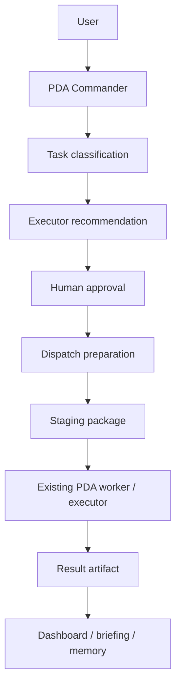

# PDA Agent Dispatch Architecture

## Purpose

PDA Agent Dispatch Phase 1 adds governed executor selection and dispatch preparation on top of the existing `PDA-Tasks` workflow.

It does **not** create a parallel queue.

## Flow

## Source of Truth

- Task queue: `PDA-Tasks/pending`
- Approval queue: `PDA-Tasks/approvals/pending`
- Approved tasks: `PDA-Tasks/approvals/approved`
- Prepared dispatch packages: `PDA-Tasks/staging/dispatch`
- Runtime worker outputs: `PDA-Tasks/running`, `PDA-Tasks/completed`, `PDA-Tasks/failed`, `PDA-Tasks/results`

## Registry

The executor registry lives in `Scripts/PDA_ExecutorRegistry.json`.

It tracks:

- executor identity
- executor type
- risk level
- approval requirement
- local-only support
- Category 2 support
- dispatch method
- output mode

## Phase 1 Controls

Phase 1 is intentionally conservative:

- recommend the best executor
- attach executor metadata to existing tasks
- require human approval before dispatch preparation
- generate staged dispatch packages
- record dispatch status for dashboard and chat surfaces
- do not auto-launch Codex, Gemini CLI, or n8n
- do not bypass approval policy
- do not introduce a parallel dispatch queue

## Dispatch Preparation

The preparation helper writes three artifacts into a dedicated staging folder:

- `dispatch-request.json`
- `dispatch-summary.md`
- `dispatch-prompt.md`

Those artifacts are derived from the approved task and executor metadata.

## Commander Behavior

PDA Commander Phase 1 can now answer:

- what should handle this task
- what executors are available
- what dispatches are waiting approval
- what is currently running
- what completed recently

It continues to treat direct slash commands as governed paths.

## Safety Gates

Always stop on:

- dirty worktree
- failed approval gate
- Category 2 cloud routing
- missing executor registry entry
- failed staging or package write
- failed validation tests

## Phase 2 Candidate Work

Potential follow-up improvements:

- automate dispatch request creation after approval
- richer executor-specific prompt templates
- executor-aware queue monitoring
- more detailed approval audit trails
- orchestration of local workers from staged executor packages
