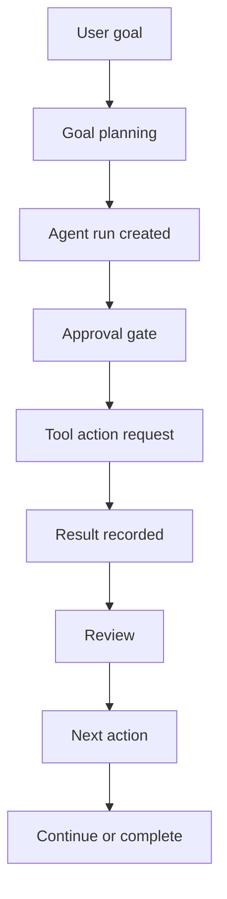

# PDA Agent Loop Architecture

PDA Agent Loop v1 adds a governed observation-and-review layer above the existing Commander stack. It does not auto-dispatch or auto-execute actions. It only prepares one action at a time, requires human approval, records the result, and computes the next action.

## Flow

## State Model

Each agent run is stored locally in `PDA-Agent-Runs/` as JSON and Markdown.

Required fields:

- `run_id`
- `goal`
- `plan`
- `current_step`
- `assigned_tool`
- `action_request`
- `result`
- `review`
- `next_action`
- `completion_criteria`

Recommended supporting fields:

- `status`
- `approval_status`
- `approval_required`
- `iteration_count`
- `max_iterations`
- `stop_reason`
- `created_at`
- `updated_at`

## Tool Registry

`Scripts/PDA_AgentToolRegistry.json` defines the agent-facing tool layer:

- `codex`
- `gemini-cli`
- `n8n`
- `execute-worker`
- `reporter-worker`
- `review-worker`
- `filesystem`
- `shell-command`

The registry is used for approval-aware tool selection and Category 1 / Category 2 enforcement.

## Governance Rules

- No action executes without approval.
- Category 2 and `restricted_local` runs must remain local-only.
- Cloud tools are blocked when policy or category restrictions disallow them.
- The loop stops at `max_iterations`.
- The loop only handles one active run at a time in v1.

## Operator Experience

The agent loop is intended to answer:

- What is the plan?
- Which tool is assigned?
- What action needs approval?
- What result was recorded?
- What should happen next?

## Implementation Notes

The first action request is generated from the first planned subtask. After the result is recorded, the next subtask becomes the next action request until completion or a stop condition is reached.
