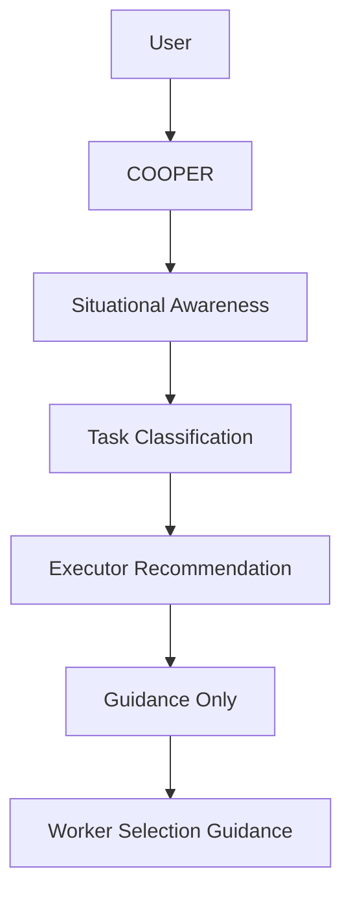

# COOPER Architecture

## Phase 1 Goal

COOPER Phase 1 adds observation and recommendation above the existing PDA chat bridge. It does not dispatch work autonomously.

## Governance Interlock

Any request that requires execution must pass through the durable approval workflow documented in [COOPER Approval Workflow](Documentation/COOPER-Approval-Workflow.md). The approval layer is the stateful gate between planning and execution and must survive restarts independently of conversation state.

## Target Flow

## Phase 1 Responsibilities

- Surface queue depth, running work, failed tasks, pending approvals, memory candidates, and dashboard health.
- Produce a daily brief with the current operating posture and recommended next actions.
- Classify requests into research, reporting, coding, automation, knowledge management, infrastructure, and administrative work.
- Recommend the best executor without dispatching.

## Behavior Rules

- Slash commands continue through the governed path.
- Natural language can map to a command internally for guidance.
- Read-only questions such as status and briefing requests answer directly.
- Ambiguous requests get one clarification.
- State-changing requests still require governed confirmation.
- No auto-dispatch, auto-approval, or autonomous task mutation in Phase 1.
- When a plan or governed action requires human approval, COOPER must persist an approval record and resume the same approval on later confirmation phrases.
- Category 1 / Category 2 restrictions continue to apply even after approval is granted.

## Recommended Executor Mapping

- Research: Gemini or local Fabric research when Category 2 constraints apply.
- Reporting: Fabric CLI.
- Review: Fabric CLI.
- Coding: Codex.
- Automation: n8n workflow.
- Knowledge management: NotebookLM for sanitized Category 1 packages.
- Infrastructure: PowerShell.
- Administrative: Human operator.

## Implementation Plan

### Phase 1

- Observation
- Assessment
- Recommendation
- Approval workflow handoff and replay

### Phase 2

- Reduce confirmation friction for safe read-only prompts.

### Phase 3

- Internal command invocation for guided workflows.

### Phase 4

- Richer agent behavior with bounded orchestration.

## Operator Prompts

- What should I work on next?
- Give me my PDA briefing.
- What is blocked?
- What needs attention?
- What changed recently?
