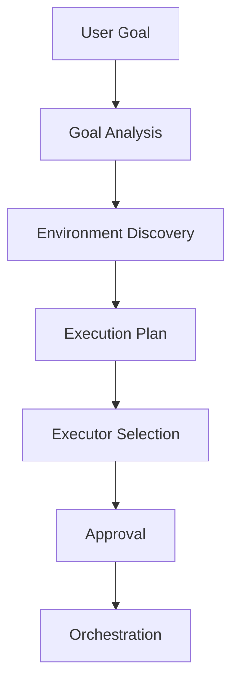

# PDA Environment Awareness Architecture

## Goal

Give COOPER read-only visibility into the local operating environment so it can reason about files, repositories, containers, services, tools, and workspace layout before proposing a plan or recommendation.

## Design Principles

- Read only by default.
- No file moves, renames, service changes, or repository mutations.
- Structured JSON output for every discovery surface.
- Reuse the existing Commander, chat bridge, and dashboard contracts.
- Keep approvals and governance intact for any downstream migration or execution plan.

## Flow

## Components

### `Scripts/PDA_Environment.ps1`

Shared helper library that implements:

- filesystem inventory
- repository inventory
- docker inventory
- service inventory
- tool inventory
- environment summary
- file organization recommendation

### Inventory Scripts

- `Scripts/Get-PDAFilesystemInventory.ps1`
- `Scripts/Get-PDARepositoryInventory.ps1`
- `Scripts/Get-PDADockerInventory.ps1`
- `Scripts/Get-PDAServiceInventory.ps1`
- `Scripts/Get-PDAToolInventory.ps1`

Each script emits structured objects and supports `-AsJson` for downstream parsing.

### Summary Script

- `Scripts/Get-PDAEnvironmentSummary.ps1`

Aggregates the inventory surfaces into a single environment snapshot for the dashboard and bridge.

### Recommendation Script

- `Scripts/Get-PDAFileOrganizationRecommendation.ps1`

Produces:

- recommended structure model
- proposed structure
- phased migration strategy
- risk assessment
- approval path

No automatic cleanup or migration is performed.

## Integration Points

### Conversational Router

`Scripts/PDA_ConversationalRouter.ps1` recognizes environment-aware questions such as:

- analyze my filesystem
- show my repositories
- what AI services are running
- help organize my folders
- recommend a better project structure

### Chat Bridge

`Scripts/Invoke-PDAChatBridge.ps1` can answer environment-aware requests with:

- goal assessment
- environment discovery
- execution plan
- approval path

### Commander Recommendation

`Scripts/Get-PDACommanderRecommendation.ps1` classifies environment-awareness requests and routes them into the governed planner path.

### Dashboard

`Scripts/Get-PDADashboardStatus.ps1` and `Scripts/Update-PDADashboard.ps1` expose:

- repositories
- running containers
- services
- workspace summary
- storage summary

## Governance

- Inventory is read only.
- Recommendations are advisory only.
- Any migration remains approval gated and manual.
- The architecture does not authorize file moves, renames, or service changes.

## Validation

The environment-awareness test harness validates:

- filesystem inventory
- repository inventory
- docker inventory
- service inventory
- tool inventory
- environment summary
- organization recommendations
- router and bridge integration
