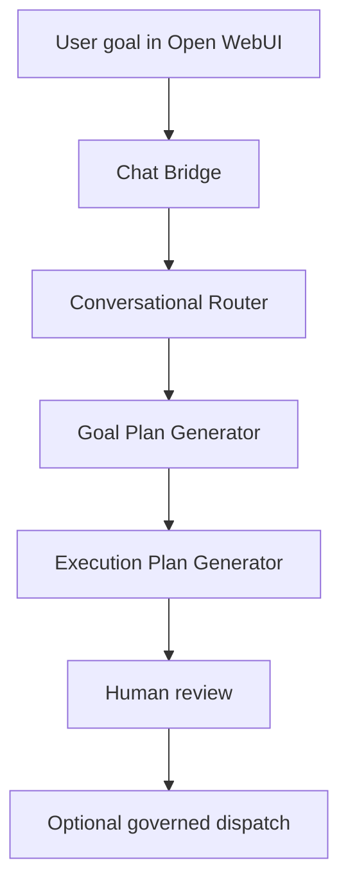

# PDA Goal Decomposition Architecture

## Purpose

Phase 2 adds a goal-oriented layer above the existing PDA command router.
It converts natural-language objectives into a structured plan without dispatching work automatically.

## Flow

## Behavior

- Slash commands still route through the governed command path.
- Natural-language goals are classified into a structured goal plan.
- The goal plan lists deliverables, subtasks, executor recommendations, and approval requirements.
- No auto-dispatch, auto-approval, or queue creation occurs in Phase 2.

## Goal Plan Outputs

- Goal summary
- Goal type and sensitivity category
- Complexity assessment
- Deliverables
- Subtasks with dependencies
- Recommended executors
- Approval path

## Execution Plan Outputs

- Ordered subtasks
- Executor chain
- Dependencies
- Deliverable mapping
- Human approval requirement

## Dashboard Integration

The dashboard exposes a Commander Planning section that shows:

- recent goals
- pending plans
- recommended executor chains
- planned deliverables

## Example

Input:

> I want to start reading classic literature. Can you search the internet, create a list of top books from famous authors, write a report, include links and synopses, and make it a PDF?

Output:

- Goal: create a classic literature reading guide PDF
- Subtasks: research authors, gather references, draft report, prepare PDF
- Recommended executors: Gemini CLI, reporter-worker
- Approval required: yes
