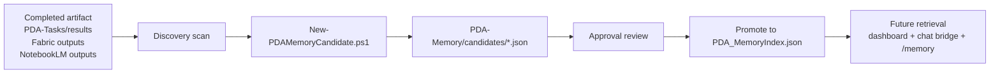

# PDA Memory Promotion Workflow

PDA now promotes completed work into memory candidates before any durable memory write occurs.



## Flow

1. Discovery scans completed artifacts from `PDA-Tasks/results`, the artifact registry, Fabric outputs, and NotebookLM outputs.
2. `Scripts/New-PDAMemoryCandidate.ps1` generates a governed memory candidate JSON file under `PDA-Memory/candidates/`.
3. Each candidate includes title, source artifact, category, summary, proposed memory text, confidence, and promotion reason.
4. Candidates remain pending until approved.
5. Approved items can later be promoted into the durable memory index.
6. The dashboard and PDA Commander surface candidate counts, pending approvals, promoted memories, and recent learning.

## Governance

- Category 1 / Category 2 rules remain unchanged.
- No candidate is auto-promoted.
- No cloud routing is introduced.
- Memory promotion remains approval-gated.

## Useful Commands

```powershell
# Generate a candidate from discovery
Scripts\New-PDAMemoryCandidate.ps1 -Discover -Limit 1 -Force

# Review memory candidate status
Scripts\Get-PDAMemoryCandidateSummary.ps1 -AsJson

# Ask PDA Commander about recent learning
Scripts\Invoke-PDAChatBridge.ps1 -Message 'What memory candidates exist?' -AsJson
```

## Phase 2 Gaps

- Approval workflow for promoting candidates into the durable memory index.
- Candidate review/decision commands for operators.
- Explicit promotion/rollback lifecycle tracking.
- More granular candidate scoring and deduplication.
- Optional memory synthesis from multiple related artifacts.

