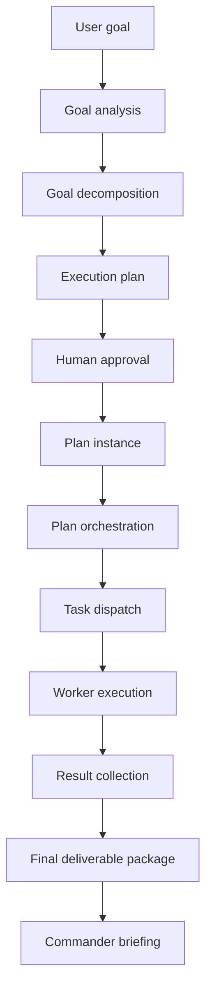

# PDA Plan Orchestration Architecture

COOPER Phase 3 extends the existing goal-planning and dispatch stack with governed plan orchestration.

The orchestration layer does not replace tasks, workers, approvals, or executor governance. It wraps them with a plan instance record so Commander can track a multi-step plan from approval through completion.

## Design Goals

- Preserve the existing task queue and worker lifecycle.
- Keep Category 2 and restricted-local work local-only.
- Require human approval before orchestration starts.
- Track dependencies, step status, results, and final deliverables.
- Stop on failure and preserve completed outputs.

## Lifecycle

## Plan Instance Model

Plan instances are stored in `PDA-Plans/` and move through these folders:

- `PDA-Plans/pending`
- `PDA-Plans/approved`
- `PDA-Plans/running`
- `PDA-Plans/completed`
- `PDA-Plans/failed`

Each plan instance records:

- `plan_id`
- `goal`
- `status`
- `created_at`
- `updated_at`
- `current_step`
- `overall_progress`
- `steps[]`
- `deliverables[]`

Each step records:

- `step_id`
- `title`
- `task_type`
- `executor`
- `depends_on[]`
- `status`
- `task_id`
- `task_path`
- `result_path`
- `blocked_reason`

## Execution Flow

1. `Get-PDAGoalPlan.ps1` decomposes the goal and generates an execution plan.
2. `New-PDAPlanInstance.ps1` converts the approved execution plan into a tracked orchestration record.
3. `Invoke-PDAPlan.ps1` validates approval, dependencies, and executor eligibility.
4. The runner submits the next eligible step into the existing task pipeline.
5. Workers execute the task and write the result artifact.
6. `Get-PDAPlanResults.ps1` aggregates step outputs into the final deliverable package.
7. `Get-PDAPlanStatus.ps1` and the dashboard surface plan health, progress, failures, and completed deliverables.

## Governance Rules

- A plan must be approved before orchestration starts.
- Plan orchestration never creates a second task system.
- Every step still passes through executor governance.
- Category 2 work remains local-only.
- If a step fails, orchestration stops and completed outputs are preserved.

## Dashboard Surface

The dashboard now shows:

- Running plans
- Blocked plans
- Plans waiting approval
- Completed plans
- Recent deliverables
- Overall progress

## Implemented Scripts

- `Scripts/New-PDAPlanInstance.ps1`
- `Scripts/Invoke-PDAPlan.ps1`
- `Scripts/Get-PDAPlanStatus.ps1`
- `Scripts/Get-PDAPlanResults.ps1`
- `Scripts/Test-PDAPlanOrchestration.ps1`

## Notes

- The orchestration layer is intentionally file-based for auditability.
- The runner can stage a single step, resume from prepared tasks, or execute the next step synchronously when a worker result is available.
- Final deliverable aggregation uses the same results artifacts the worker pipeline already writes.
