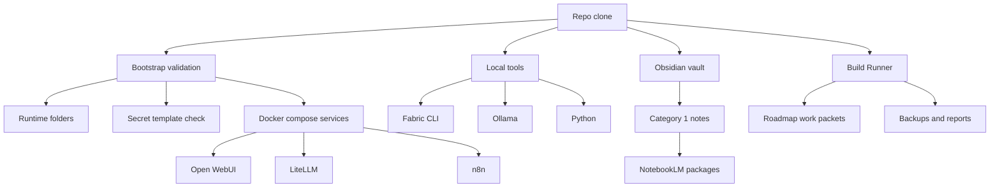

# PDA Portable Deployment Guide

This guide packages the PDA ecosystem into a repeatable workstation deployment that can be moved to another machine without turning the repo into a snowflake.

## Current Runtime Inventory

The current workstation has these runtime dependencies available:

| Dependency | Status | Notes |
|---|---|---|
| PowerShell 7 | Present | `7.6.2` |
| Git | Present | `2.50.0.windows.1` |
| Docker | Present | `29.5.2` |
| Python | Present | `3.12.10` |
| Fabric CLI | Present | `1.4.454` via `%USERPROFILE%\.local\bin\fabric.exe` |
| Ollama | Present | `0.30.5` |
| Obsidian | Present | `C:\Users\earth\AppData\Local\Programs\Obsidian\Obsidian.exe` |
| Open WebUI | Configured | `PDA-Runtime/docker-compose.yml` service `open-webui` |
| LiteLLM | Configured | `PDA-Runtime/docker-compose.yml` service `litellm` |
| n8n | Configured | `PDA-Runtime/docker-compose.yml` service `n8n` |

## Portable Architecture



## Required Local Layout

Create or preserve these paths on the target machine:

- `PDA-Runtime/`
- `PDA-Runtime/configs/`
- `PDA-Runtime/data/`
- `PDA-Runtime/logs/`
- `PDA-Runtime/.env.example`
- `litellm/.env.local`
- `PDA-Backups/`
- `PDA-Backups/notebooklm/`
- `PDA-Backups/build-runner/logs/`
- `PDA-Backups/build-runner/reports/`
- `Roadmap/work-packets/`
- `Roadmap/codex-prompts/`

## Secrets and Environment Variables

Do not store real secrets in the repository.

### Secret placeholders

Use placeholders in `PDA-Runtime/.env.example` and keep the real values in local-only storage:

- `LITELLM_MASTER_KEY`
- `OPENAI_API_KEY`
- `ANTHROPIC_API_KEY`
- `GEMINI_API_KEY`
- `OPENROUTER_API_KEY`
- `WEBUI_SECRET_KEY`
- `N8N_ENCRYPTION_KEY`

### Local secret location

The current compose stack still reads:

- `litellm/.env.local`

That file is ignored by git. Copy the template locally and fill the secrets on the target machine only.

## Bootstrap Workflow

1. Clone or copy the repo to the target machine.
2. Install or verify Docker Desktop / Docker Engine.
3. Install or verify PowerShell 7.
4. Install or verify Git, Python, Ollama, and Fabric CLI.
5. Confirm Obsidian is installed and the vault path is correct.
6. Run the deployment validator:

```powershell
pwsh -File Scripts\Test-PDADeployment.ps1 -AsJson -NoThrow
```

7. Run the installer in dry-run mode first:

```powershell
pwsh -File Scripts\Install-PDAEcosystem.ps1 -DryRun -AsJson -NoThrow
```

8. If the report shows only warnings, run the installer without `-DryRun` and create any local config you need.
9. Keep `litellm/.env.local` and any other secret-bearing files out of git.

## Tool Routing Notes

- **Open WebUI** is the chat UI and command center.
- **LiteLLM** is the governed provider gateway.
- **n8n** hosts the webhook bridge for the Open WebUI chat path.
- **Ollama** provides local model access for restricted workflows.
- **Fabric CLI** handles local pattern execution for sanitized inputs.
- **Python** supports helper scripts and local automation utilities.
- **Obsidian** stores the vault, reports, and learning notes.

## Category 1 / Category 2 Separation

- Category 1 material can be sanitized for cloud-safe workflows.
- Category 2 material must stay local and use approved local-only routes.
- NotebookLM packages must be built from Category 1 notes only.
- Fabric aliases should only receive sanitized inputs when the input could leave the local workspace.

## Validation Commands

```powershell
pwsh -File Scripts\Test-PDADeployment.ps1 -AsJson -NoThrow
pwsh -File Scripts\Install-PDAEcosystem.ps1 -DryRun -AsJson -NoThrow
pwsh -File Scripts\Test-PDAFabricHealthCheck.ps1 -AsJson -NoThrow
pwsh -File Scripts\Test-PDANotebookLMCommand.ps1 -AsJson -NoThrow
pwsh -File Scripts\Test-PDACapabilityRouter.ps1 -AsJson -NoThrow
```

## Migration Checklist

Use the companion checklist in `Documentation/PDA-Migration-Checklist.md` to move the ecosystem to a new workstation with fewer surprises.
