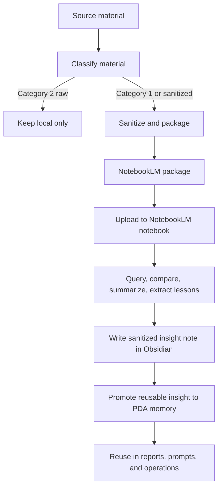

# NotebookLM Integration Guide

Updated: 2026-06-06

## Purpose

NotebookLM is the ecosystem's cloud-based learning surface for sanitized, Category 1 source material only.

Use it for:
- courses
- manuals
- training transcripts
- public or sanitized research
- learning summaries
- reusable concepts that can safely leave the local workspace

Do not upload raw Category 2 material.

## Workflow



## Step-by-Step Process

1. Collect the source material locally.
2. Classify it before any upload.
3. If the material is Category 2, keep it local and stop.
4. If the material is Category 1 or can be sanitized, apply the sanitization checklist.
5. Build a NotebookLM package with a manifest, source files, and questions.
6. Upload the sanitized package to the correct learning-area notebook.
7. Ask targeted questions inside NotebookLM.
8. Save the best insights to Obsidian as a capture note.
9. Promote durable, reusable, sanitized takeaways into PDA memory.
10. Archive the raw package locally if it is no longer active.

## Learning Areas

Create one NotebookLM notebook per learning area:

| Learning area | NotebookLM notebook | Purpose |
|---|---|---|
| Training | `PDA - Training` | Courses, certifications, study notes |
| AI Systems | `PDA - AI Systems` | Architecture, tooling, and platform learning |
| Research | `PDA - Research` | Public or sanitized research synthesis |
| Leadership | `PDA - Leadership` | Communication, decision-making, and management frameworks |

## Recommended Package Locations

Use a local staging structure before upload:

```text
PDA-Backups/notebooklm/
├── Training/
├── AI-Systems/
├── Research/
└── Leadership/
```

Recommended package contents:

```text
<topic>/
├── sources/
├── manifest.json
├── summary.md
└── questions.md
```

## Obsidian Integration Points

Use the following vault folders for NotebookLM outputs:

- `04_Resources/` for reference notes and reusable concepts
- `05_Reports/` for learning summaries and synthesis notes
- `06_AI-Systems/` for architecture and tooling notes
- `08_Prompts/` for reusable questions and prompt patterns
- `10_Archive/` for older learning packages and retired notes

## PDA Memory Integration Points

Promote NotebookLM output into PDA memory only when it is:
- sanitized
- reusable
- durable
- not tied to private or restricted source detail

Best candidates:
- frameworks
- patterns
- checklists
- distilled lessons
- repeatable methods
- architecture summaries

## Category 1 / Category 2 Rule

- Category 1 may be sanitized and uploaded to NotebookLM.
- Category 2 raw material must never leave the local workspace.
- If the material cannot be safely sanitized, do not upload it.
- If a note becomes sensitive again after review, move it back to local-only storage.

## Generator Script

Use the PDA helper script to build upload-ready packages:

```powershell
pwsh -NoProfile -File .\Scripts\New-PDANotebookLMPackage.ps1 `
  -LearningArea "Training" `
  -Topic "Power BI Fundamentals" `
  -SourcePaths @(
    ".\Obsidian Vault\02_Projects\AI Tool Ecosystem\Some Sanitized Note.md"
  ) `
  -Summary "NotebookLM package for the Power BI fundamentals course." `
  -Questions @(
    "What are the key concepts?",
    "What patterns repeat across the sources?",
    "What should I remember later?"
  )
```

The script writes the package to:

```text
PDA-Backups/notebooklm/<learning-area>/<topic>/<topic>-<timestamp>/
```

## PDA Command Path

You can also create NotebookLM packages through the governed PDA command workflow with `/notebooklm`.

Example:

```text
/notebooklm
LearningArea: Research
Topic: NotebookLM Command Integration Test
SourcePaths:
- Obsidian Vault\02_Projects\AI Tool Ecosystem\NotebookLM\NotebookLM-Integration-Guide.md
- Obsidian Vault\02_Projects\AI Tool Ecosystem\NotebookLM\NotebookLM-Sanitization-Checklist.md
Summary:
Sanitized NotebookLM package for local learning validation.
Questions:
- What are the main steps?
- Which notes are safe to upload?
```

The command path is governed and local-only:

1. PDA interpreter maps the request to `/notebooklm`.
2. The handoff invokes `Scripts/Invoke-PDANotebookLMCommand.ps1`.
3. The helper calls `Scripts/New-PDANotebookLMPackage.ps1`.
4. The result is recorded in `PDA-Tasks/results`.
5. The package stays local until you upload it manually to NotebookLM.

## Execution Checklist

- [ ] Classify the source material
- [ ] Redact secrets, identifiers, and sensitive operational details
- [ ] Create the NotebookLM package
- [ ] Upload the package to the correct notebook
- [ ] Query NotebookLM for summary, comparison, and lessons
- [ ] Capture the insights in Obsidian
- [ ] Promote only reusable sanitized insights to PDA memory
- [ ] Archive the package locally when done
